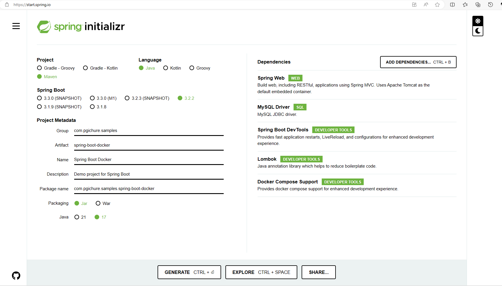

## Running Spring Boot and MySQL Using Docker Compose

This application shows how to run a Spring Boot application connected to MySQL database on Docker using Docker Compose.
For this tutorial, you would require the following setup in your development environment;  
-  Java Development Kit (JDK)  
-  Favourite IDE  
-  Maven (you can use your favorite build tool)   
-  Docker   

### Creating Spring Boot Application
Go to Spring Initializer site and generate a project with the dependencies you want. Ensure you include MySQL dependency.  
  
Download the project and include it in your IDE for further editing.  

### Create Sample Controller
Create a simple controller BookController to return a simple JSON as below. Remember in this article we are concetrating on the deployment. NOT on logic complexity.  

```java

/**
 * 
 */
package com.pgichure.samples.springbootdocker.controllers;

import org.springframework.beans.factory.annotation.Autowired;
import org.springframework.http.HttpStatus;
import org.springframework.http.ResponseEntity;
import org.springframework.jdbc.core.JdbcTemplate;
import org.springframework.web.bind.annotation.GetMapping;
import org.springframework.web.bind.annotation.RequestMapping;
import org.springframework.web.bind.annotation.RestController;
/**
 * @author pgichure
 */
@RestController
@RequestMapping("/books")
public class BookController {
	
	@Autowired
    private JdbcTemplate jdbcTemplate;
	
	@GetMapping
    public ResponseEntity<String> getUsers() {
        String query = "SELECT COUNT(*) FROM books";
        Integer count = jdbcTemplate.queryForObject(query, Integer.class);
        return new ResponseEntity<>("Total books: " + count, HttpStatus.OK);
    }

}


```
This returns the current count of books in the library.  

### Configuring the Database
Create a file application.yaml with the following content;  

```yaml
server:
  port: 9099
spring:   
  application:
    name: spring-boot-docker
  main:
    banner-mode: "off"
  datasource:
    driver-class-name: com.mysql.cj.jdbc.Driver
    url: jdbc:mysql://localhost:3306/samples_dev_db?createDatabaseIfNotExist=true&useSSL=false&allowPublicKeyRetrieval=true
    username: mysqluser
    password: Mysql123#@!
    platform: mysql
    initialization-mode: always
    hikari:
      connection-timeout: 60000
      maximum-pool-size: 5
  jpa:
    hibernate:
      ddl-auto: update  
      naming-strategy: org.hibernate.cfg.ImprovedNamingStrategy
    properties:
      hibernate:
        dialect: org.hibernate.dialect.MySQL8Dialect
    generate-ddl: true
    show-sql: false
```
    
This file specifies the port, application name and database connection details to be used. We shall use this in our Docker configuration files.  

### Create the Dockerfile
Docker uses images. To achieve this, we will need to have a file that have configurations that informs how this image shall be built. Create a file Dockerfile in the root directory of your application with the below content;

```yaml
FROM openjdk:23-slim
WORKDIR /app
COPY target/spring-boot-docker-1.0.0.jar .
EXPOSE 9099
ENTRYPOINT ["java","-jar","spring-boot-docker-1.0.0.jar"]
```
Notice the line 4. We are exposing port 9099 which is the same port we set in the applications.yaml. Also, the shall be naming our jar file as spring-boot-docker-1.0.0.jar.  

Additionally, we will create a Docker Compose file that will configure the services required to run our application.  
Create a new file named docker-compose.yaml in the root directory of the project with the following content:  

```yaml
services:
  mysql:
    image: 'mysql:latest'
    environment:
      - 'MYSQL_DATABASE=samples_dev_db'
      - 'MYSQL_PASSWORD=Mysql123#@!'
      - 'MYSQL_USER=mysqluser'
      - 'MYSQL_ROOT_PASSWORD=Root123#@!'
      
    ports:
      - '3307:3307'
  application:
    build: .
    ports:
      - "9099:9099"
    depends_on:
      - mysql
    environment:
      SPRING_DATASOURCE_URL: jdbc:mysql://localhost:3307/samples_dev_db?createDatabaseIfNotExist=true&useSSL=false&allowPublicKeyRetrieval=true
      SPRING_DATASOURCE_USERNAME: mysqluser
      SPRING_DATASOURCE_PASSWORD: Mysql123#@!
volumes:
  mysql-data:
```
This defines the database service and application service.
The application service uses the Dockerfile we created earlier to build an image of the Spring Boot application. It also defines environment variables to configure the database connection.

### Build and Run the Application
With the Dockerfile and Docker Compose file, you can build and run the application using Docker Compose. Open your terminal and run the following command in the root directory of the project:

```bash 
$ docker-compose up --build
```

This command will build the Docker image for our Spring Boot application and start the MySQL and application containers. Once the containers are running, you should be able to access the application at http://localhost:9099/books

### Source Code
You can access the source code from Github [here](https://github.com/gichure/spring-boot-app-docker.git).